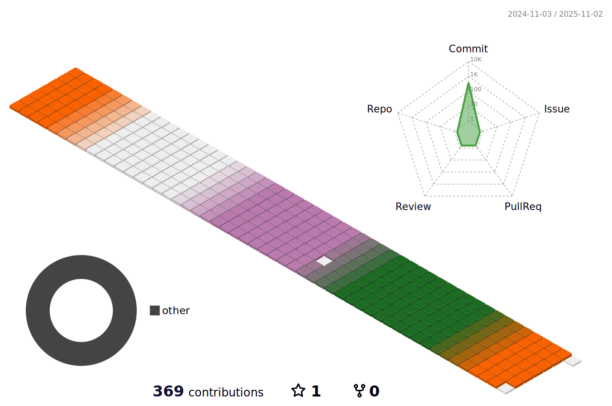

## I'm ☁
- 📚 currently studying front-end, react, javascript.
- 💘 I love Techs, Science, Computer, Designs.
- ⛄ I Love to Learn someting new everytime.
- 🌞 Solving Every Morning !
  
 

  <h2>My Tech ⛸</h2>
  
  
  
  
   
  
  
  
  
  
   
  
  
  
  
  
   
  
  
	
  
  
   
  
  

  <h2>Contact 📞</h2>
  
  
  

## Plants 🌱

